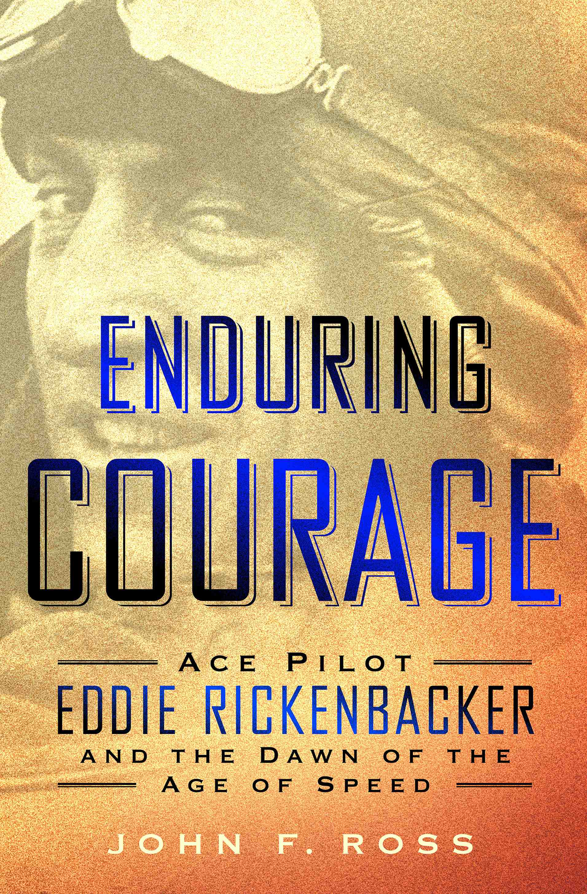

  

    <!-- Main column -->
    

      

        

          
          

            <h4>Buy the book</h4>
            

              <a href="http://www.barnesandnoble.com/w/enduring-courage-john-f-ross/1116932705?ean=9781250033772">Barnes &amp; Noble</a> 
              <a href="http://www.amazon.com/Enduring-Courage-Pilot-Eddie-Rickenbacker/dp/1250033772">Amazon</a> 
              <a href="http://www.indiebound.org/book/9781250033772">Indiebound</a> 
              <a href="https://itunes.apple.com/us/book/enduring-courage/id782941786?mt=11">iTunes</a>
            

          

        

        

          <h1>Enduring Courage</h1>
          <h2>Ace Pilot Eddie Rickenbacker and the Dawn of the Age of Speed</h2>
          
St. Martin's Press: May 13, 2014.

          
At the turn of the twentieth century two new technologies &ndash; the car and airplane &ndash; took the nation's imagination by storm as they burst, like comets, into American life. The brave souls that leaped into these dangerous contraptions and pushed them to unexplored extremes became new American heroes: the race car driver and the flying ace.

          
No individual did more to create and intensify these raw new roles than the tall, gangly Eddie Rickenbacker, who defied death over and over with such courage and pluck that a generation of Americans came to know his face better than the president's...

          
<a href="./enduring-courage.html">Read more &raquo;</a>

        

      

      

      

        

          
        

        

          
John F. Ross's most recent book is <em>Enduring Courage: Ace Pilot Eddie Rickenbacker and the Dawn of the Age of Speed</em>, a narrative non-fiction book for St. Martin's Press. The Wall Street Journal called his previous book, <em>War on the Run: The Epic Story of Robert Rogers and the Conquest of America's First Frontier</em> (Random House, 2009), "a lively, evocative and moving biography." Formerly the editor of <em>American Heritage</em> and <em>Invention &amp; Technology</em> magazines, he is the recipient of the 2011 Fort Ticonderoga Award for Contributions to American History. Before that he was on the Board of Editors of <em>Smithsonian</em> magazine, during which he wrote four cover stories.

        

      

    

    <!-- Right rail -->
    

      <h3>Around the Web</h3>
      
<small>iTunes</small> <a href="https://itunes.apple.com/us/book/enduring-courage/id782941786?mt=11">Apple selects <em>Enduring Courage</em> as a top ten pick for non-fiction books in May.</a>

      
<small>Article</small> <a href="http://ricks.foreignpolicy.com/posts/2014/05/15/why_todays_readers_can_learn_from_a_new_book_about_wwi_hero_rickenbacker">"Why today's readers can learn from a new book about WWI hero Rickenbacker" by Thomas E. Ricks, ForeignPolicy.com</a>

      
<small>Video</small> <a href="http://www.c-span.org/video/?319417-3/panel-discussion-world-wars">John F. Ross participates in panel discussion on the World Wars at the 2014 Gaithersburg, MD Book Festival</a>

      <h3>Perils of Car Racing</h3>

      <iframe width="100%" height="210" src="//www.youtube.com/embed/haKLzn4GQn8?rel=0" frameborder="0" allowfullscreen></iframe>

      

      <h3>Audio Excerpt</h3>
      <iframe width="100%" height="166" scrolling="no" frameborder="no" src="https://w.soundcloud.com/player/?url=https%3A//api.soundcloud.com/tracks/145338028&amp;color=ff5500&amp;auto_play=false&amp;hide_related=false&amp;show_artwork=true"></iframe>

      

      <h3>Next Event</h3>

      
Thursday, May 29, 2014 at 6pm 
      Reading and Signing 
      Pritzker Military Museum &amp; Library 
      104 S. Michigan Ave., 
      Chicago, IL 60603 
      312.374.9333 
      <a href="http://pritzkermilitary.org">pritzkermilitary.org</a>

    

  

