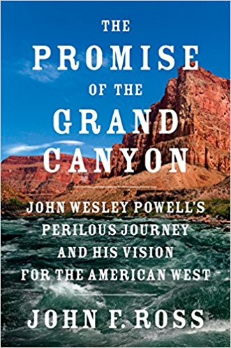

  

    <!-- Main column -->
    

      

        

          

          

            <h4>
              <a href="https://www.amazon.com/Promise-Grand-Canyon-Perilous-American/dp/0525429875/ref=tmm_hrd_swatch_0?_encoding=UTF8&qid=1516142856&sr=1-1">
                Buy the book
              </a>
            </h4>

              <!-- <a href="http://www.barnesandnoble.com/w/enduring-courage-john-f-ross/1116932705?ean=9781250033772">Barnes &amp; Noble</a>
                -->
              <!-- <a href="https://www.amazon.com/Promise-Grand-Canyon-Perilous-American/dp/0525429875/ref=tmm_hrd_swatch_0?_encoding=UTF8&qid=1516142856&sr=1-1">Amazon</a> -->
              <!--  
              <a href="http://www.indiebound.org/book/9781250033772">Indiebound</a>
               
              <a href="https://itunes.apple.com/us/book/enduring-courage/id782941786?mt=11">iTunes</a> -->
          

        

        

          <h1>The Promise of the Grand Canyon</h1>
          <h3>John Wesley Powell's Perilous Journey and His Vision for the American West</h3>
          <h5>Viking: July 3, 2018.</h5>

           

          

            A timely, thrilling account of a man who, as an explorer, dared to lead the first succesful expedition down the Colorado through the Grand Canyon &mdash; and, as an American visionary, waged a bitterly-contested campaign for environmental sustainability in the American West.
          

          

            When John Wesley Powell became the first person to navigate the entire Colorado River, through the Grand Canyon, he completed what Lewis and Clark had begun nearly 70 years earlier &mdash; the final exploration of continental America. The son of an abolitionist preacher, a Civil War hero (who lost an arm at Shiloh), and a passionate naturalist and geologist, in 1869 Powell tackled the vast and dangerous gorge carved by the Colorado River and known today (thanks to Powell) as the Grand Canyon.
          

          

            With <em>The Promise of the Grand Canyon</em>, John Ross recreates Powell's expedition in all its glory and terror, but his second (unheralded) career as a scientist, bureaucrat, and land-management pioneer concerns us today. Powell was the first to ask: how should the development of the west be shaped? How much could the land support? What was the role of the government and private industry in all of this? He began a national conversation about sustainable development when most everyone else still looked upon land as an inexhaustible resource. Though he supported irrigation and dams, his prescient warnings forecast the 1930s dustbowl and the growing water scarcities of today. Practical, yet visionary, Powell didn't have all the answers, but was first to ask the right questions.
          

        

      

      

      

        

          
        

        

          

            John Ross is a former editor of <em>American Heritage</em> and an adventure writer with extensive whitewater experience. His previous books are 
            <em>Enduring Courage: Ace Pilot Eddie Rickenbacker and the Dawn of the Age of Speed</em> and <em>War on the Run: The Epic Story of Robert Rogers and the Conquest of America's First Frontier</em>, which won the Fort Ticonderoga Award for Contributions to American History.
          

        

      

    

    <!-- Right rail -->
    

      <h3>Around the Web</h3>

      
<small>News</small> Tune in as John F. Ross appears on <a href="https://www.sciencefriday.com/"><em>Science Friday</em></a> (July 6), and NPR's <a href="http://www.wbur.org/onpoint"><em>On Point</em></a> (July 12)

      
<small>Article</small> <a href="https://longreads.com/2018/07/02/taming-the-great-american-desert/">"Taming the Great American Desert" by John F. Ross, Longreads</a>

      
<small>Article</small> <a href="https://www.axios.com/newsletters/axios-pm-69388126-893a-4849-8e49-521711a6295e.html"><em>The Promise of the Grand Canyon</em> is this week's beach read. Mike Allen, Axios</a>

      
<small>Article</small> <a href="https://www.outsideonline.com/2304721/john-wesley-powells-perilous-journey-down-colorado">"The Prophet of the Dust Bowl" by John F. Ross, Outside</a>

      
<small>Article</small> <a href="https://www.wsj.com/articles/the-prophet-of-thedust-bowl-1528987986">"John Wesley Powell's Perilous Journey Down the Colorado" by John F. Ross, WSJ.com</a>

    

  

